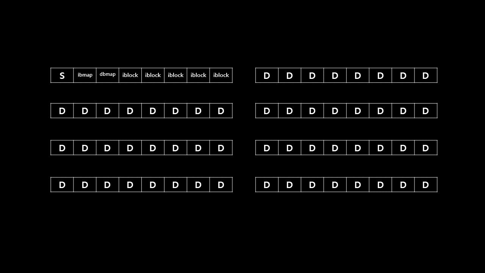
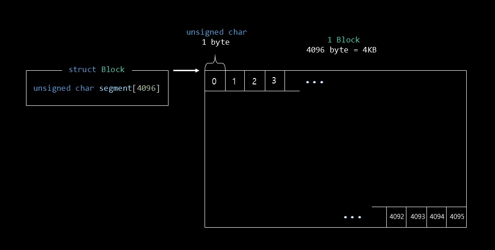
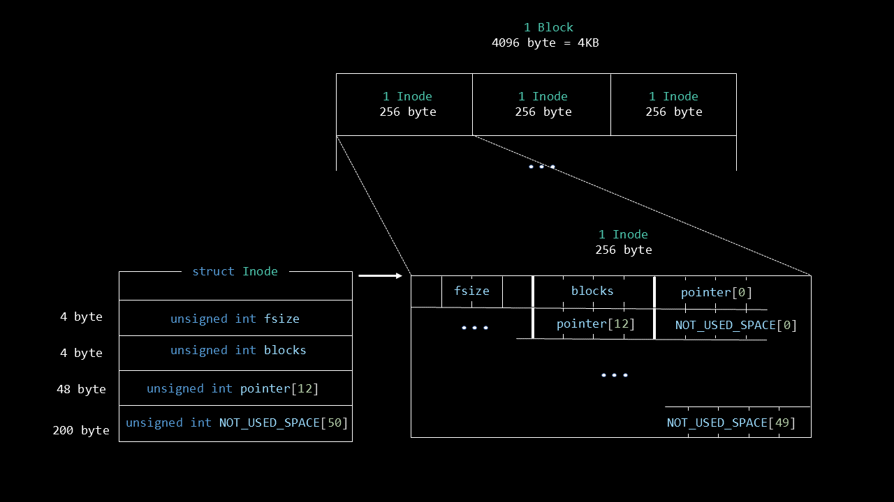
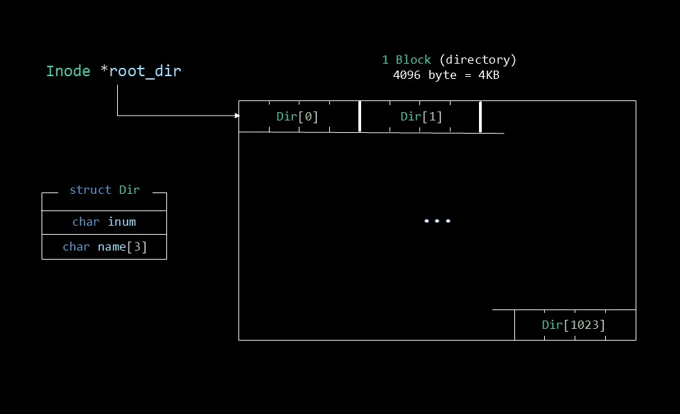
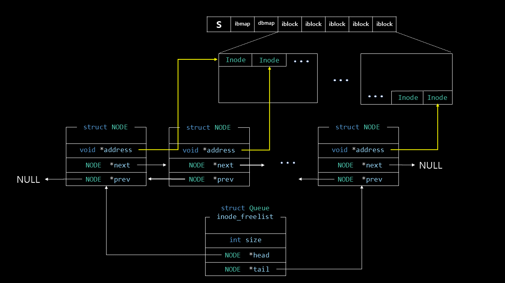
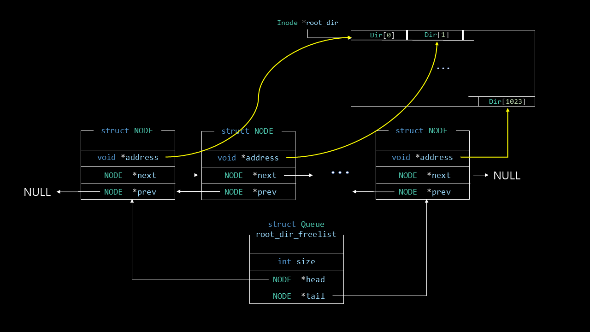

# File System

Implementation of File System at application level

 

## Introduction

Emulation of a simple file system

- Block size: 4KB
- inode size: 256B

 

## Overall of Disk

- S: Super Block
- ibmap: Inode bitmap
- dbmap: Data region bitmap
- iblock: Inodes
- D: Data region

 

## Data structures

### block

### Inode

### Root Directory

### Inode freelist

### Root Directory freelist

 

## Run

`$ fs <input_file>`
